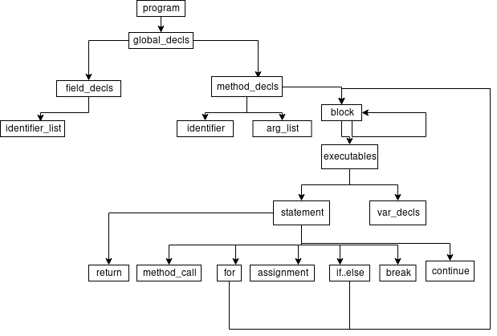

# Introduction

A simple compiler for `Decaff` toy language.

## Directory Structure

```
.
├── benchmarks  // Folder containing the test benchmarks
│   ├── arraysum.dcf    // Sum of elements in an array
│   ├── bubble.dcf      // Bubble sort
│   ├── maxmin.dcf      // Maximum and minimum element of an array
│   ├── nextmax.dcf     // Second minimum from array
│   └── sumn.dcf        // Sum of first n number
├── CMakeLists.txt      // Cmake configuration file to build Project
├── README.md           // This File :P
└── src     // Master directory for the source; Each file contains information
    │            on how to generate code and build AST
    ├── arg_list.cpp    // Argument Description of the function declared
    ├── assignment.cpp  // Assignment operators
    ├── binary_op.cpp   // Binary operators
    ├── block.cpp       // Block of code. Block is any statement between {...}
    ├── codegenerator.cpp   // File containing common variables and functions related to codegeneration
    ├── decaff.l    // Lexer for Decaff
    ├── decaff.ypp  // Parser for Decaff
    ├── executables.cpp // Contains executables, i.e., Statement or Assignment
    ├── expression.cpp  // Expression Class - Arithmetic(Binary and Unary), Relational, Logical
    ├── field_decls.cpp // Global Field Decalaration
    ├── for.cpp         // For loop
    ├── global_decl.cpp // Global Declaration - Field and Method
    ├── headers         // Header files for respective .cpp files
    │   ├── arg_list.h
    │   ├── assignment.h
    │   ├── binary_op.h
    │   ├── block.h
    │   ├── codegenerator.h
    │   ├── executables.h
    │   ├── expression.h
    │   ├── field_decls.h
    │   ├── for.h
    │   ├── global_decl.h
    │   ├── identifier.h
    │   ├── identifier_list.h
    │   ├── if_else.h
    │   ├── literal.h
    │   ├── location.h
    │   ├── method_call.h
    │   ├── method_decls.h
    │   ├── node.h
    │   ├── param_list.h
    │   ├── program.h
    │   ├── statement.h
    │   ├── unary_op.h
    │   └── var_decl.h
    ├── identifier.cpp      // Identifier Class
    ├── identifier_list.cpp // List of identifier in declaration
    ├── if_else.cpp         // Conditional
    ├── literal.cpp         // Constants - boolean, char or integer
    ├── location.cpp        // Location Access(name from identitfier)
    ├── method_call.cpp     // Calling a method in block
    ├── method_decls.cpp    // Declaring a method
    ├── param_list.cpp      // Passing arguments to a function
    ├── program.cpp         // Main Program Class(root for AST)
    ├── statement.cpp       // Statement class - can be block, if, for, variable declaration,
    ├── unary_op.cpp        // unary operator(+, -)
    └── var_decl.cpp        // variable declaration
```

## Building and Running

### Build

```
mkdir build
cd build

# To build in Debug Mode
cmake -DCMAKE_BUILD_TYPE=Debug ..

# To build in Release mode
cmake -DCMAKE_BUILD_TYPE=Release ..

# Debug by default
cmake ..

make
```

### Run

```
# In build directory

# Read from stdin and write to stdout
./bin/decaff

# Read from a file and write to stdout
./bin/decaff <file_in>

# Read from a file and write to stdout
./bin/decaff <file_in> <file_out>
```

The program currently takes input from stdin and prints output codegen to stdout.

## Code Structure

Each source `.cpp` file contains one class and has its corresponding header `.h` file.
`program` is the main source file which references all the structures inside it. It
corresponds to the class `Program` which is the main class in `Decaff` language.
Look at the diagram below for more clarification on Language Structure.

